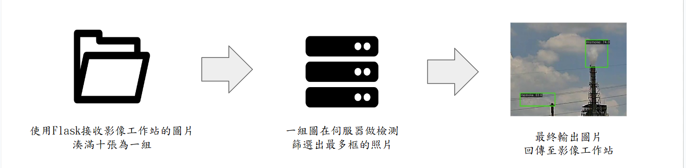
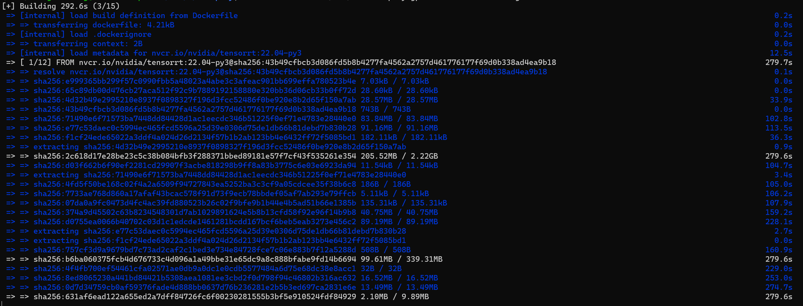
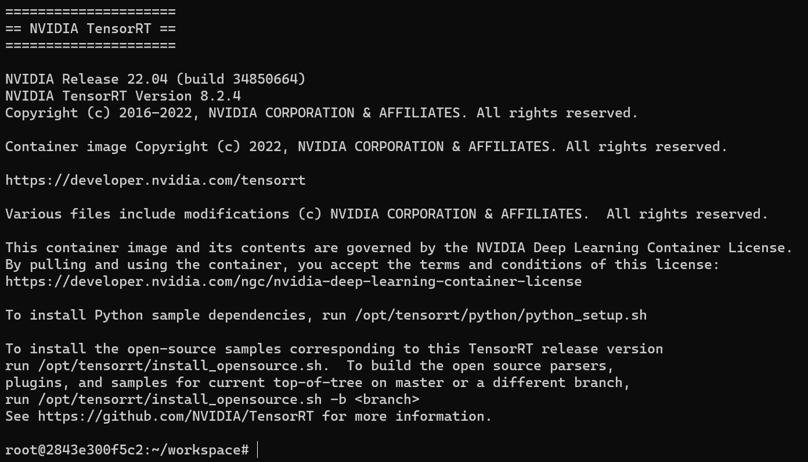
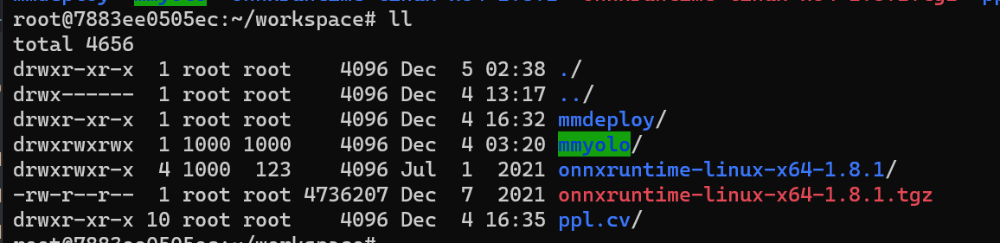
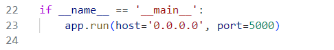
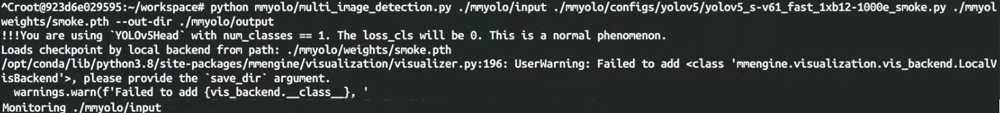

# SMOKE A40 DEPLOY README

## 系統架構圖

<div align="center">
  
  <p>煙霧檢測系統架構圖</p>
</div>

## 安裝


以下將會引導你如何安裝此專案到你的伺服器上。

前置需要Docker來進行安裝作業

python 版本建議為：`3.8.0` 

### 取得專案

```bash
git clone -b MMYOLO_A40_Deploy https://gitlab.com/prophet.ai.inc/smoke-detection-only-detection.git
```

### 移動到專案內
先將專案名稱改成mmyolo
```bash
cd mmyolo
```

#

### 創建虛擬環境與進入環境

```bash
conda create -n A40_Deploy python==3.8
conda activate A40_Deploy
```
#

### 安裝Torch

請先根據使用電腦的cuda來安裝pytorch

[Pytorch下載連結(推薦使用版本2.0.0)](https://pytorch.org/get-started/previous-versions/)

#

### 安裝MMYOLO

```bash
pip install -U openmim
mim install -r requirements/mminstall.txt
mim install "mmyolo"
```


#

### 安裝MMDeploy並架設Docker Containter

>Step1. 下載MMdeploy
```bash
git clone -b dev-1.x https://github.com/open-mmlab/mmdeploy.git
cd mmdeploy
```


>Step2. 修改MMDeploy的Dockerfile

前往mmdeploy\docker\GPU 並使用文字編輯器或VSCode開啟Dockerfile

將ONNXRUNTIME_VERSION從<font color="red">1.8.1</font>改成<font color="red">1.15.1</font>

<div align="center">
  
  <p>將ONNXRUNTIME_VERSION從1.8.1改成1.15.1</p>
</div>

>Step3. 構建Docker

```bash
docker build docker/GPU/ -t mmdeploy:gpu
```
執行後會進行構建，需要等待一段時間

<div align="center">
  
  <p>安裝畫面</p>
</div>

>Step4.創建Docker Container (Windows)

```bash
docker run --memory=8g --memory-swap=8g --gpus '"device=0"' mmdeploy:gpu #指定執行時消耗VRAM上限
set MMYOLO_PATH=/path/to/local/mmyolo # 先將專案 MMYOLO 的路徑寫入環境變量
docker run --gpus all --name mmyolo-deploy -v %MMYOLO_PATH%:/root/workspace/mmyolo -it mmdeploy:gpu /bin/bash
```
>Step4.1. 創建Docker Container (Linux)
```bash
export MMYOLO_PATH=/path/to/local/mmyolo # 先將專案 MMYOLO 的路徑寫入環境變量
docker run --gpus all --name mmyolo-deploy -v ${MMYOLO_PATH}:/root/workspace/mmyolo -it mmdeploy:gpu /bin/bash
```
<div align="center">
  
  <p>安裝完成就會進入Container的終端中</p>
</div>

<div align="center">
  
  <p>可以使用ll指令確認mmyolo資料夾是否有掛載</p>
</div>

>Step5. 在Container中安裝套件

```bash
export MMYOLO_PATH=/root/workspace/mmyolo # 這裡不需要修改
cd ${MMYOLO_PATH}
mim install mmdet==3.0.0
mim install mmcv==2.0.1
export MMYOLO_VERSION=$(python -c "import mmyolo.version as v; print(v.__version__)")  # 查看使用的 MMYOLO 版本號
echo "Using MMYOLO ${MMYOLO_VERSION}"
mim install --no-cache-dir mmyolo==${MMYOLO_VERSION}
pip install --no-cache-dir pycuda==2022.2
pip install watchdog
```

#

### 修改對應的Server IP

開啟mmyolo/image_server.py，修改host的IP使其符合伺服器IP，如在本地端測試則無需修改
<div align="center">
  
  <p></p>
</div>

#
###  放置權重以及相關config

#### 此步驟請與相關負責人員提供檔案，此處不公開內容
#### 若取得到攝影機ip資訊檔案，須根據以下位置擺放
```bashs
mmyolo
  ├─ config.ini
  ├─ image_server.py
  ├─ multi_image_detection.py
  ├─ bot.py
  ├─ weights #如果沒有請自行創建
  │   └── smoke.pth
  └──  smoke_camera_config.json

```


## 執行主程式

#### 執行image_server.py
開啟新的終端機
```bash
conda activate mmyolo
python image_server.bat
```

#### 運行MMYOLO檢測主程式(Windows)

```bash
start_docker.bat
```
#### 運行MMYOLO檢測主程式(Linux)
```bash
docker start mmyolo-deploy
docker exec -it mmyolo-deploy /bin/bash 
python mmyolo/multi_image_detection.py ./mmyolo/input ./mmyolo/configs/yolov5/yolov5_s-v61_fast_1xb12-1000e_smoke.py ./mmyolo/weights/smoke.pth --out-dir ./mmyolo/output
```
<div align="center">
  
  <p>如果出現Monitoring即是檢測執行中</p>
</div>


## 聯絡作者

你可以透過以下方式與我聯絡

- [mail](https://youtu.be/dQw4w9WgXcQ?si=0Zn783lq8yKOQlL1)
