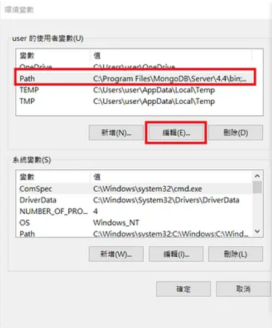
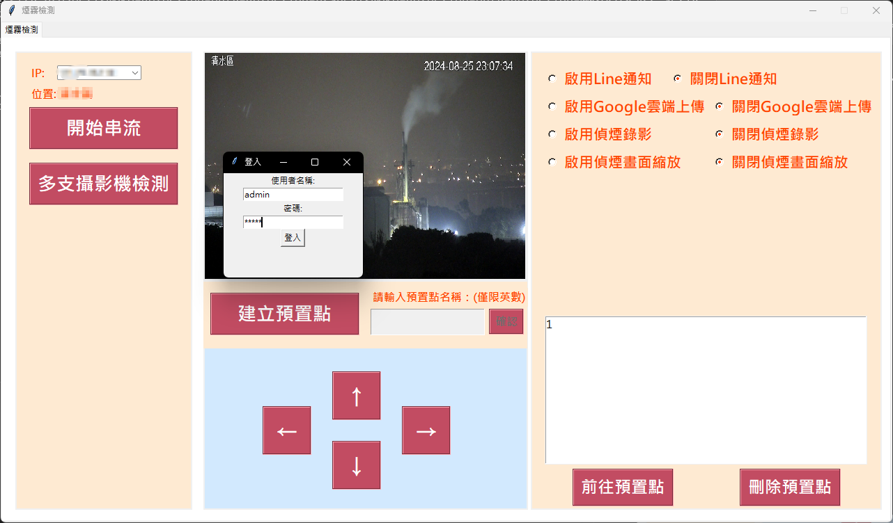

# SMOKE MMYOLO REWORK README

## 系統架構圖

<div align="center">
  
  <p>煙霧檢測系統架構圖</p>
</div>

## 安裝


以下將會引導你如何安裝此專案到你的電腦上。

python 版本建議為：`3.8.0` 

### 取得專案

```bash
git clone -b MMYOLO_rework_detection https://gitlab.com/prophet.ai.inc/smoke-detection-only-detection.git
```

### 移動到專案內

```bash
cd smoke-detection-only-detection
```

#

### 創建虛擬環境與進入環境

```bash
conda create -n smoke python==3.8
conda activate smoke
```

### 安裝套件

```bash
pip install -r requirement.txt
```

#

### 下載MongoDB

[MongoDB官網下載連結](https://www.mongodb.com/try/download/community)

<div align="center">
  
  <p>點擊紅框處下載即可</p>
</div>


### MongoDB環境變數設定

>Step 1 在windows 開始的搜尋視窗搜尋 '編輯環境系統變數'，進入(圖1)視窗

>Step 2 再(圖1)中，點環境變數(N)，會跳出視窗(如圖2)

>Step 3 再(圖2)中，點選最上白框變數中的Path，接著點選編輯(E)會進入(圖3)的視窗。

>Step 4 再(圖3)中，點選新增 (N)，加入MongoDB當初的安裝位置。位置形式可以參考(圖3)中環境變數的第一列。


<div align="center">
  
  <p>(圖1)</p>
  
  <p>(圖2)</p>
  
  <p>(圖3)</p>
</div>

## 運行專案

>Step1. 下載Mongo配置包及配置包放置處

[MongoDB配置包](https://drive.google.com/file/d/1Ukp0q9xOb4HpaqYtfaHIHpqCowsjq7fz/view?usp=sharing)

配置包放置於專案內最外層
```bashs
smoke-detection-only-detection
  ├─MongoDB
  │  ├─data
  │  └─log
  │   mongod.cfg
  │   start_mongodb.bat
  ├─main.py
  ├─utility.py
  └─page.py
```

>Step2. 執行MongoDB配置檔內的執行檔來啟動MongoDB

##### 於MongoDB資料夾內鍵入指令或者直接雙擊start_mongodb.bat檔

#### 鍵入指令

```bash
cd MongoDB
start_mongodb.bat
```

<div align="center">
  
  <p>有看到此訊息代表啟動成功，請別關閉它</p>
</div>

>Step3. 給定攝影機ip檔案

#### 此步驟請與相關負責人員提供檔案，此處不公開內容
#### 若取得到攝影機ip資訊檔案，須根據以下位置擺放
```bashs
smoke-detection-only-detection
  ├─MongoDB
  ├─main.py
  ├─utility.py
  ├─page.py
  └─smoke_camera_config.json
```


>Step4. 執行主程式

#### 鍵入指令
```bash
python main.py
```

#### 或者是直接運行bat檔

```bash
start_UI.bat
```

## 功能

測試帳號密碼 **（僅提供測試帳號密碼）**


## 檔案說明

- main.py - 主程式
- utility.py - 程式主功能
- page.py - UI介面建置
- element.py - 自訂義元件類
- all_camera.py - 檢視n個攝影機同時錄影功能
- start.bat - 運行腳本，內包括進環境及運行主程式


## 運行畫面展示

<div align="center">
  
  <p>執行畫面</p>
  
  <p>讀取ip後</p>
  
  <p>登出畫面</p>
</div>

>Step5. 執行多支攝影機檢測

#### 鍵入指令
```bash
python all_camera.py
```

#### 或者是直接運行bat檔

```bash
start_all.bat
```

#### 或者從使用介面進行開啟

<div align="center">
  
  <p>按下紅色框中的按鈕也可以直接執行多支攝影機檢測程式</p>
</div>

## 運行畫面展示

<div align="center">
  
  <p>它會根據設定檔中的所輸入的攝影機IP來顯示</p>
</div>

## 聯絡作者

你可以透過以下方式與我聯絡

- [mail](https://youtu.be/dQw4w9WgXcQ?si=0Zn783lq8yKOQlL1)
